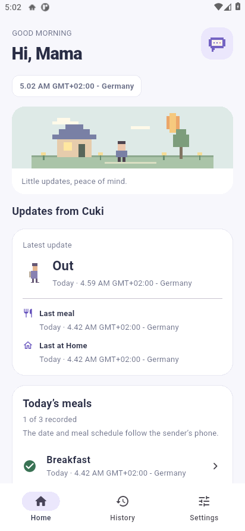
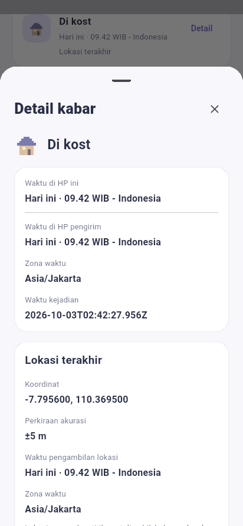

# abc 0.5.0 — pratinjau

Screenshot dari aplikasi Flutter yang berjalan pada emulator Android, dengan nama/status QA. Pengirim memakai Indonesia/WIB/24 jam; penerima memakai English/Germany/AM-PM. Jam malam dan koordinat GPS pada contoh merupakan **simulasi uji**.

## Pengirim dan penerima

| Beri kabar · Indonesia | Terima kabar · English, AM/PM |
|---|---|
|  |  |

Panggilan dipilih sebelum masuk dan hanya dipakai pada HP itu. Format waktu ada di **Pengaturan → Format jam**; tersedia 24 jam dan 12 jam AM/PM. Bahasa dibatasi Indonesia, English, dan Deutsch.

## Konfirmasi dan Detail

| Periksa sebelum mengirim | Detail suatu kejadian |
|---|---|
|  |  |

Detail dapat digulir untuk melihat seluruh informasi dan tombol peta. Koordinat, akurasi dan waktu lokasi berasal dari kejadian itu; catatan tanpa GPS tidak meminjam lokasi terakhir.

## Satu waktu, dua mode

Keduanya menunjukkan **18.00 WIB - Indonesia**. Langit pixel mengikuti malam, sementara mode layar tetap mengikuti pilihan pengguna.

| In Relationship · Gelap | In Relationship · Terang |
|---|---|
|  |  |

## Default dan pengaturan

Tema Default memakai periwinkle/krem. In Relationship memakai rose/lilac, dua karakter dan hati pixel. Tema serta mode hanya mengubah HP yang memilihnya.

| Default | Pengaturan Appearance |
|---|---|
|  |  |

Pagi 05–11 · Siang 11–15 · Sore 15–18 · Malam 18–05. Batas ini mengikuti jam lokal HP; bukan waktu matahari terbit/terbenam astronomis.

## Ikon aplikasi

[Unduh abc.apk](abc.apk) · [Panduan](README.md) · [Hasil QA](QA.md)
