# abc — Cozy Pixel Art

Desain Flutter terbaru memadukan komponen Shadcn, judul Pixelify dan ikon pixelarticons. Terang memakai cream/lavender, gelap memakai navy/slate; pembuka, pilihan peran, Beranda, Riwayat, Pengaturan dan dialog kini memakai gaya cozy yang konsisten.

[Galeri setiap halaman dan daftar perubahan](crossplatform/PREVIEW_LOKAL.md)

Gambar berikut dirender dari halaman Flutter yang sebenarnya dengan data simulasi Nara/Yogyakarta. **Ini pratinjau renderer lokal, belum screenshot emulator atau HP fisik.** Pemeriksaan statis bersih dan 43 tes unit/widget lulus. QA emulator/perangkat untuk desain baru masih menunggu instruksi; APK **0.9.0** sudah memuat desain baru ini; build release, signature dan aset suara sudah diverifikasi.

## Arsip tampilan rilis abc 0.8.0 — dua cerita, satu dunia pixel

[Unduh APK Android 10 ke atas](https://raw.githubusercontent.com/Adelberth-Von/App-kabarcuki/refs/heads/main/abc.apk?v=0.9.0) · [Panduan pemasangan dan mode dua arah](README.md) · [Hasil QA](QA.md)

Seirama kini menjadi **mode berbagi dua arah** dengan persetujuan pada kedua HP. Beranda, widget, kartu status dan dunia pixel disusun ulang. Contoh menggunakan nama, jam dan data simulasi; bukan lokasi pengguna nyata. Rincian pengujian perangkat dan keterbatasannya ada pada laporan QA.

## Beranda dengan dunia pixel berlapis

| Mode satu arah | Mode Seirama |
|---|---|
| 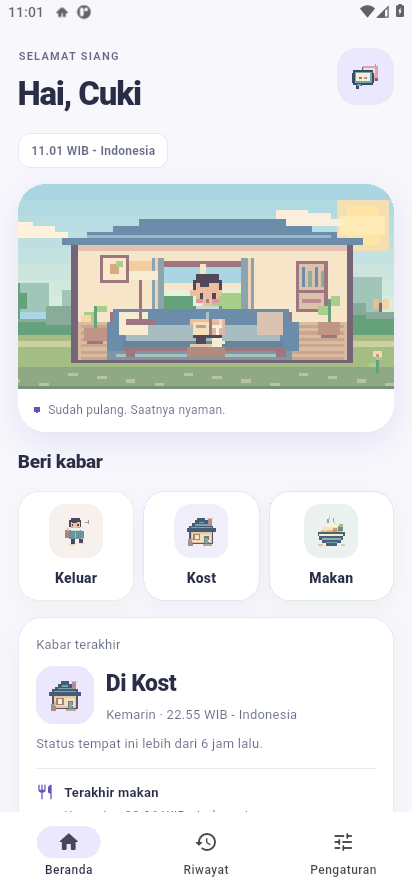 | 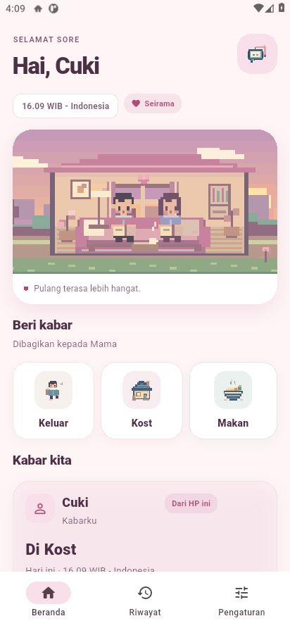 |

Ilustrasi yang lebih besar memiliki lapisan langit, bukit, rumah, jalur taman, pohon dan detail penghuni kecil. **Keluar** memakai adegan berjalan; **Kost** berpindah ke ruang dengan sofa dan buku; **Makan** memakai meja, mangkuk dan uap. Seirama menambahkan karakter pasangan dengan gerakan menyambut, melambaikan tangan dan makan bersama. Konfirmasi menampilkan adegan tindakan sebelum kabar dikirim.

Sapaan dan langit mengikuti pagi, siang, sore dan malam menurut jam lokal HP. Burung, kupu-kupu, daun, cahaya jendela serta bintang memperkaya suasana. **Terang/Gelap** tetap pilihan terpisah: mode terang pada malam hari memakai kartu terang dan langit malam.

[Putar rekaman animasi dan alur aplikasi](screenshots/abc08-motion.mp4).

Animasi halaman menggunakan **12 frame per detik** dengan siklus 120 frame, serta transisi ketika tindakan atau mode berganti. Canvas ilustrasi digambar ulang tanpa membangun ulang seluruh halaman. Gerakan berhenti ketika ilustrasi tidak terlihat, tertutup dialog, aplikasi tidak aktif, atau preferensi/sistem meminta pengurangan gerakan.

## Seirama: kabarmu dan kabar pasangan

**Mode berbagi → Seirama → Aktifkan Seirama** selalu meminta konfirmasi. Masing-masing HP menukar kode **KB2.** dan mengonfirmasi kode dari HP lain. Aplikasi menunjukkan keterangan menunggu sampai kedua arah terhubung. Tampilan Seirama versi lama menawarkan migrasi dengan konfirmasi; membatalkan tetap mempertahankan peran satu arah.

Kartu **Kabarku** menampilkan tindakan pemilik HP. Kartu **Kabar pasangan** hanya untuk dilihat, dengan nama, tindakan terakhir dan waktunya sendiri. Mengirim Makan dari satu HP tidak menimpa lokasi, jadwal makan atau riwayat HP lain. Riwayat menyediakan pilihan milik sendiri/pasangan. Detail pasangan dapat membuka titik yang mereka bagikan melalui peta.

Warna rose/lilac dan dua karakter mengikuti mode Seirama yang sudah diaktifkan. Pengaturan **Tampilan** berisi Terang/Gelap dan Animasi pixel; Seirama dipilih di **Mode berbagi**. Bahasa serta format waktu tetap merupakan pilihan setiap HP.

## Kabar pribadi dan kredit pengembang

| Dua riwayat terpisah | Pengaturan |
|---|---|
| 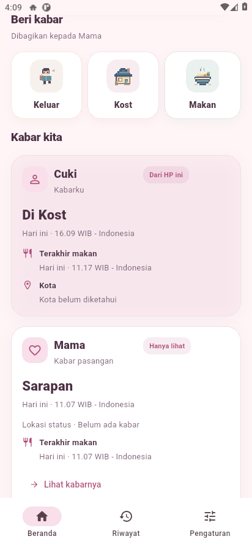 | 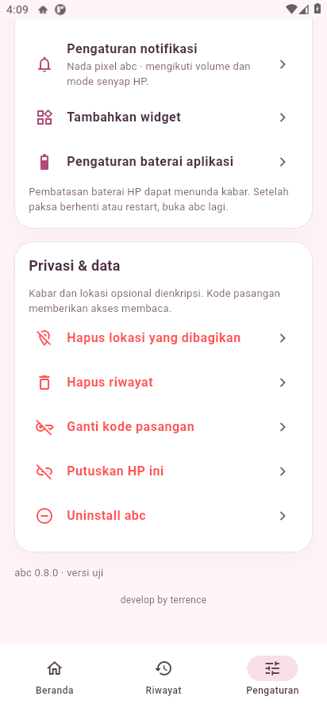 |

Teks **develop by terrence** tersedia di bagian bawah Pengaturan pada Android dan iPhone.

## Widget adaptif dengan artwork yang lebih besar

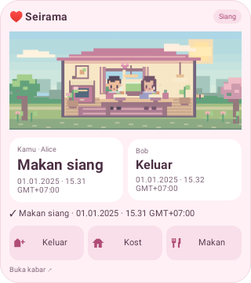

Contoh widget di atas dirender oleh pemeriksaan layout native dengan data uji Alice/Bob. Artwork mengisi ruang yang tersedia. Ukuran ringkas menggunakan thumbnail di sebelah kartu; ukuran sedang/besar memperluas ilustrasi serta menampilkan kartu status, waktu dan tombol. Tata letak menyesuaikan orientasi dan ukuran tulisan; informasi tambahan dapat diringkas pada ukuran sangat kecil dengan tulisan besar.

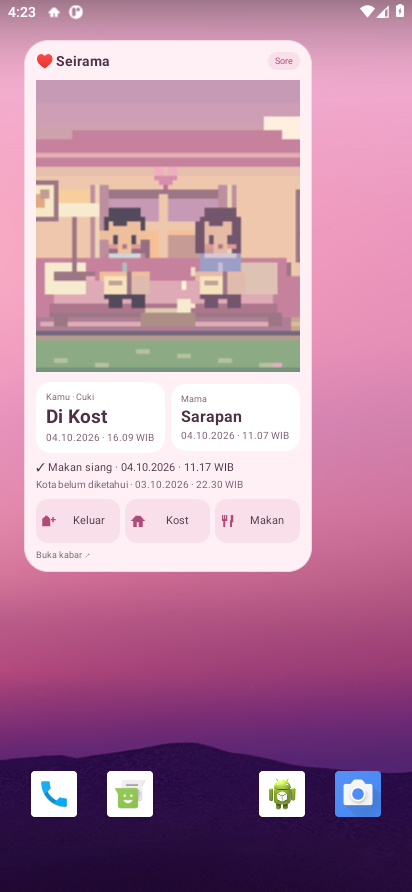

Widget di layar utama emulator pada APK release: nama dan catatan simulasi Cuki/Mama. Pengujian memeriksa gerakan frame, berhenti saat hemat daya, kembali bergerak, serta konfirmasi ketika tombol tindakan diketuk.

Dalam Seirama, kartu pemilik HP dan pasangan tetap terpisah. Tindakan terbaru menjadi informasi utama, termasuk kategori makan ketika kabar terakhir adalah Makan. Ketuk kartu pasangan untuk membuka detailnya. Tombol **Keluar/Kost/Makan** selalu membuka konfirmasi untuk status pemilik HP.

Android menggunakan **delapan frame**, jeda **240 ms** dan transisi **90 ms** yang dikelola launcher. Gambar 320×128 menggunakan total sekitar **640 KiB** untuk delapan frame. Tidak ada timer animasi di layanan sinkronisasi. Widget menjadi statis saat belum terhubung, koneksi dijeda, hemat daya/pengurangan animasi aktif, atau sakelar Animasi pixel dimatikan. Perilaku widget di luar layar mengikuti launcher; perubahan fase pagi–malam mengikuti pembaruan widget sistem berkala dan tidak selalu seketika.

Widget iPhone memiliki hierarki small/medium/large, kartu kabar sendiri/pasangan, dan transisi pada pembaruan data atau timeline. **WidgetKit mengatur waktu pembaruannya; widget iPhone tidak menjalankan loop terus-menerus seperti beranda aplikasi.** Tombol tindakan membuka aplikasi untuk meminta konfirmasi. Instalasi iPhone fisik serta notifikasi saat aplikasi tertutup masih memerlukan signing Apple/TestFlight dan deployment server APNs.

## Notifikasi dan suara khusus

Notifikasi kabar baru memakai nama pengirim, tindakan, waktu lokal, kota bila tersedia, serta ilustrasi pixel Android. **abc pixel chime** adalah tiga nada pendek berdurasi 1,08 detik; [dengarkan contohnya](res/raw/abc_chime.wav). Suara mengikuti volume notifikasi, mode senyap, Jangan Ganggu dan pengaturan saluran notifikasi HP. Mengubah format jam tidak memutar ulang nada.

Format **24 jam/AM-PM** diterapkan pada status, jadwal, riwayat, detail, widget dan notifikasi yang masih tampil. Setiap HP memakai zona waktunya sendiri; waktu kejadian yang tersimpan tetap sama. Indonesia, English dan Deutsch tersedia pada pengaturan bahasa.

## Lokasi dan kategori makan

Lokasi menampilkan daerah/kota, waktu pengambilan dan zona tanpa angka koordinat. **Lihat di peta** memakai koordinat tepat. GPS diambil sekali setelah pilihan dan izin pemilik HP, tanpa pelacakan latar belakang. Jika layanan lokasi mati, pengguna diarahkan ke pengaturan sistem; abc tidak menyalakan GPS diam-diam.

Kategori makan selalu mengikuti jadwal dan jam lokal pengirim ketika disimpan. Jika Sarapan diketuk pukul 18.00 pada jadwal makan malam 17.00–22.00, yang dicatat adalah **Makan malam**. Di luar semua rentang, dicatat sebagai **Makan** tanpa mencentang kategori lain. Setiap orang di Seirama memiliki catatan serta jadwal sendiri.

## Tampilan iPhone dari QA simulator

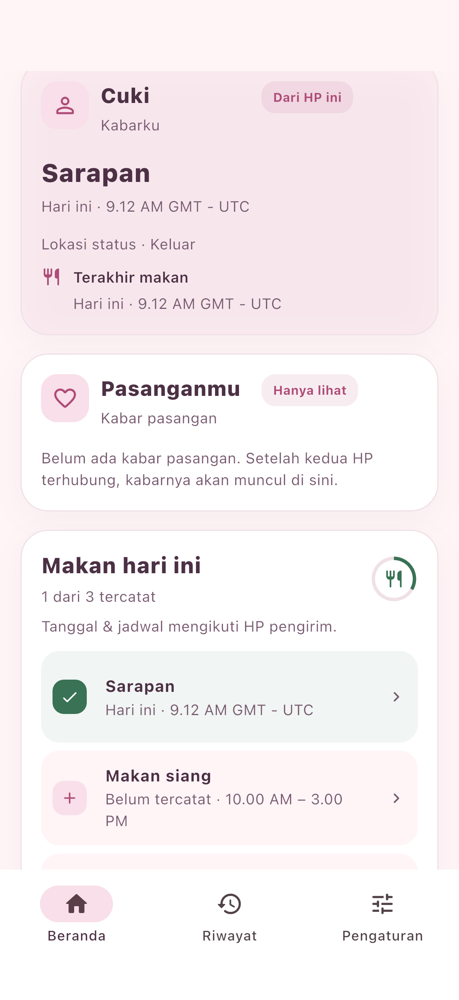

Contoh ini memperlihatkan mode Seirama sebelum kode pasangan dipasang; kartu pasangan menjelaskan langkah berikutnya. Proyek iPhone memakai UI Flutter yang sama.

## Arsip tampilan 0.7.0

Lihat gambar dan perilaku versi 0.7.0 sebelumnya

### abc 0.7.0 — pixel art yang mengikuti kabar

[Unduh APK Android 10 ke atas](https://raw.githubusercontent.com/Adelberth-Von/App-kabarcuki/refs/heads/main/abc.apk?v=0.9.0) · [Panduan](README.md) · [Hasil QA](QA.md)

Gambar Android berasal dari APK release yang berjalan pada dua emulator khusus uji. Nama, jam dan titik GPS merupakan data simulasi; tidak menunjukkan lokasi pengguna nyata. Gambar iPhone berasal dari rangkaian QA simulator yang lulus.

## Lihat gerakannya

[Putar rekaman 30 detik dari APK release](screenshots/abc07-motion.mp4): Keluar berjalan membawa tas, Kost beristirahat/membaca, dan Makan memakai mangkuk, sendok serta uap. Tema hubungan kini bernama **Seirama**: pasangan melambaikan tangan, menyambut pulang atau makan bersama. Konfirmasi juga menampilkan adegan tindakan yang dipilih.

| Beranda Seirama, malam | Konfirmasi tindakan |
|---|---|
| 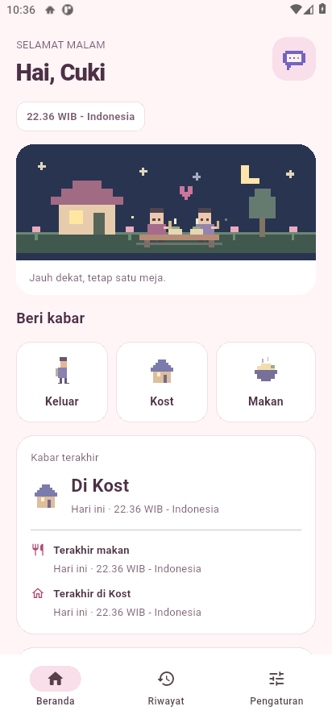 | 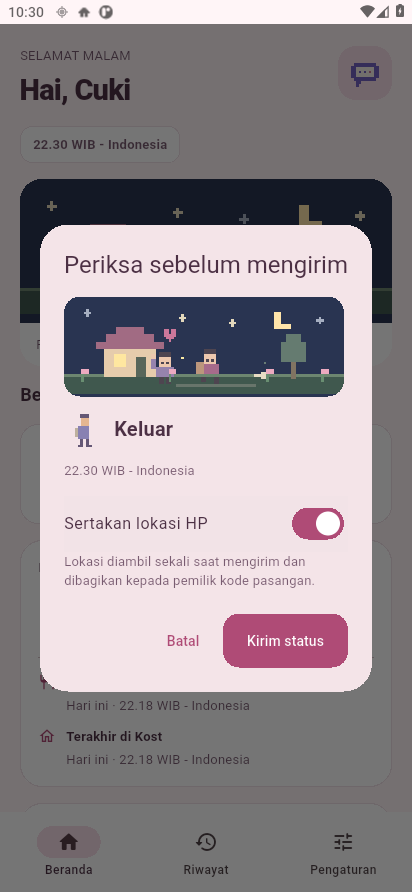 |

## Widget yang lebih jelas

Nama, fase hari, status dan waktunya dipisahkan agar mudah dibaca. Ilustrasi menjaga proporsi karakter, lalu informasi makan, kost dan kota tampil di bawahnya. Tombol berikon membuka konfirmasi di aplikasi. Ukuran kecil merangkum informasi; ukuran besar menampilkan lebih banyak detail.

| Widget Seirama | Widget Default |
|---|---|
| 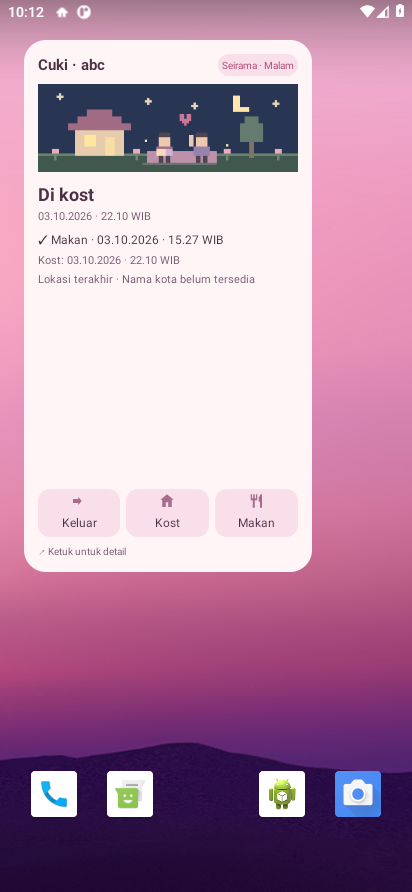 | 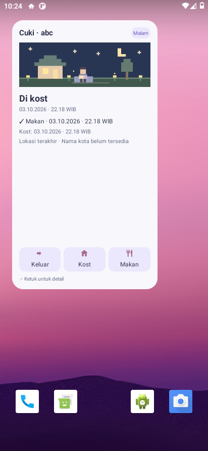 |

Android menggunakan dua frame ringan setiap 1,5 detik saat widget terlihat. Animasi berhenti pada hemat daya, pengurangan animasi atau saat sakelar Animasi pixel dimatikan. Widget iPhone menggunakan transisi saat data diperbarui, mengikuti batas WidgetKit. Widget Android mengikuti fase waktu pembaca melalui pembaruan sistem berkala; perubahan fase tidak selalu seketika di layar utama.

## Notifikasi dan suara khusus

Notifikasi Android menampilkan ilustrasi pixel, tindakan, waktu lokal, kota jika tersedia dan tombol **Lihat kabar**. Nada asli **abc pixel chime** terdiri dari tiga nada pendek dengan durasi 1,08 detik. Dengarkan [contoh suara](res/raw/abc_chime.wav). Suara mengikuti volume notifikasi, mode senyap, Jangan Ganggu dan pilihan pada pengaturan notifikasi HP. Pembaruan format jam tidak membunyikan ulang notifikasi.

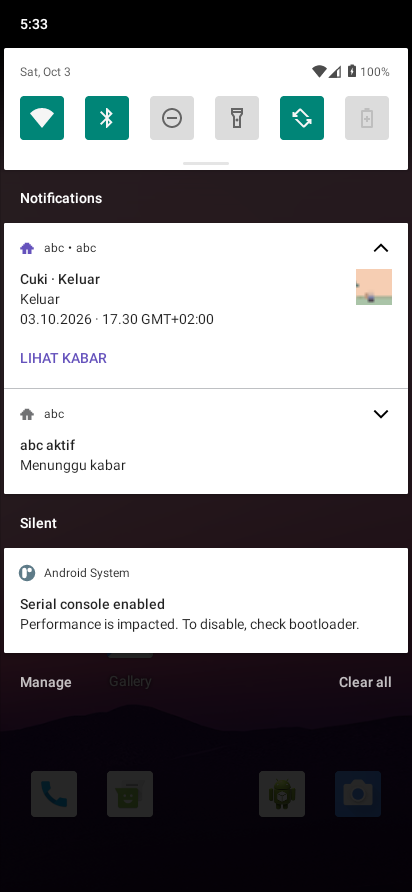

Nada yang sama sudah dibundel pada proyek iPhone. Instalasi pada iPhone fisik dan notifikasi APNs masih memerlukan signing Apple/TestFlight serta deployment server.

## Pagi, siang, sore dan malam

Burung pada pagi hari, kupu-kupu pada siang hari, daun pada sore hari, serta bintang/kunang-kunang pada malam hari mengikuti jam lokal HP. Mode **Terang/Gelap** tetap merupakan pilihan terpisah. Contoh berikut adalah frame yang dirender oleh tes canvas aplikasi, bukan mockup.

| Tema dan tindakan | Pagi · 08.00 | Siang · 12.00 | Sore · 16.00 | Malam · 20.00 |
|---|---|---|---|---|
| Default · Keluar |  |  |  |  |
| Default · Kost |  |  |  |  |
| Default · Makan |  |  |  |  |
| Seirama · Keluar |  |  |  |  |
| Seirama · Kost |  |  |  |  |
| Seirama · Makan |  |  |  |  |

Animasi di aplikasi memakai empat frame per detik pada canvas kecil, berhenti ketika tidak terlihat atau aplikasi tidak aktif. Format 24 jam/AM-PM berlaku serentak pada status, rentang makan, riwayat, Detail, widget dan notifikasi. Setiap HP tetap memakai zona serta preferensinya sendiri.

## Lokasi dan kategori makan

| Detail lokasi | Aktivasi lokasi | Kategori mengikuti jam |
|---|---|---|
| 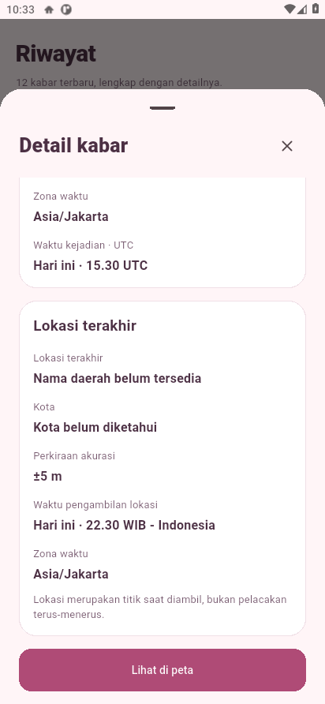 | 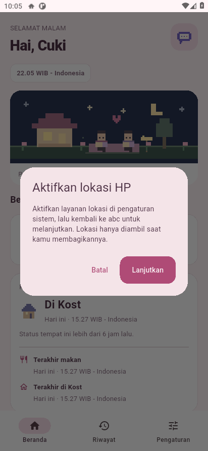 | 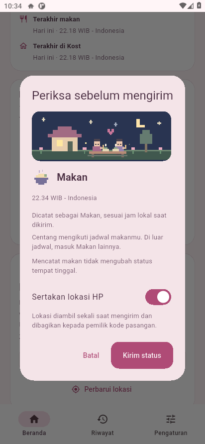 |

Lokasi menampilkan daerah, kota, waktu pengambilan dan zona waktu; **Lihat di peta** tetap memakai koordinat tepat. Pada emulator, layanan pencarian nama tidak tersedia sehingga contoh menampilkan keterangan belum diketahui. GPS diambil sekali setelah persetujuan. Jika layanan lokasi mati, pengguna diarahkan ke pengaturan sistem lalu pengambilan dilanjutkan setelah kembali.

Jika Sarapan diketuk pukul 18.00 dan jadwal makan malam 17.00–22.00, kategori yang dicatat adalah **Makan malam**. Contoh screenshot pukul 22.34 berada di luar jadwal awal, sehingga dicatat sebagai **Makan** tanpa mencentang kategori lain. Kategori ditentukan dari jam lokal pengirim ketika catatan disimpan.

## Tampilan iPhone

| Seirama pada iPhone | Pengaturan iPhone |
|---|---|
| 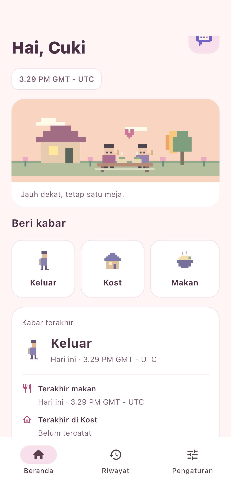 | 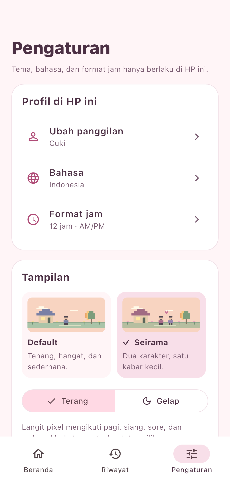 |

Seluruh alur integrasi selesai dan menghasilkan sembilan screenshot pada [QA Flutter Android/iPhone](https://github.com/Adelberth-Von/App-kabarcuki/actions/runs/37132886142). CI iPhone menggunakan GMT/UTC; zona tersebut adalah pengaturan simulator, bukan lokasi pengguna.

## Ikon aplikasi

Bahasa tersedia dalam Indonesia, English dan Deutsch. Panggilan dipilih sebelum masuk, kemudian dipakai untuk sapaan pada HP tersebut.

