# abc 0.6.0 — pratinjau

Screenshot dari aplikasi Flutter yang berjalan pada emulator Android, dengan nama/status QA. Pengirim memakai Indonesia/WIB/24 jam; penerima memakai English/Germany/AM-PM. Jam malam dan koordinat GPS pada contoh merupakan **simulasi uji**.

## Pixel art bergerak

[Lihat rekaman animasi dari APK release](screenshots/abc-motion.mp4). Karakter berkedip/melambaikan tangan, awan/bunga bergerak pelan dan bintang berkelip. Tema In Relationship menambah hati melayang. Animasi berhenti otomatis saat tidak terlihat atau hemat daya aktif; tersedia sakelar Animasi pixel pada Appearance.

Format 24 jam/AM-PM berlaku serentak pada status, jadwal makan, riwayat, Detail UTC/GPS, widget dan notifikasi. Setiap HP tetap memakai zona dan preferensinya sendiri.

## Pengirim dan penerima

| Beri kabar · Indonesia | Terima kabar · English, AM/PM |
|---|---|
| 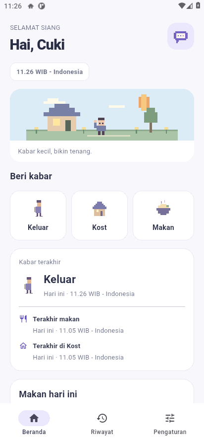 | 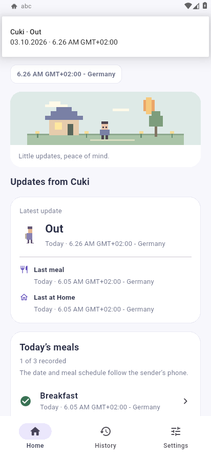 |

Panggilan dipilih sebelum masuk dan hanya dipakai pada HP itu. Format waktu ada di **Pengaturan → Format jam**; tersedia 24 jam dan 12 jam AM/PM. Bahasa dibatasi Indonesia, English, dan Deutsch.

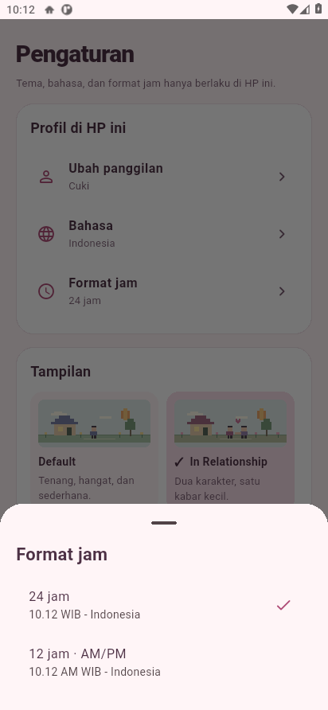

## Konfirmasi dan Detail

| Periksa sebelum mengirim | Detail suatu kejadian |
|---|---|
| 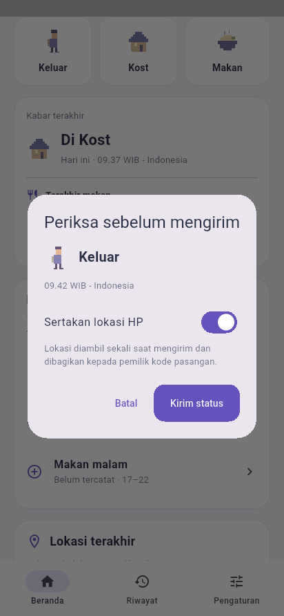 | 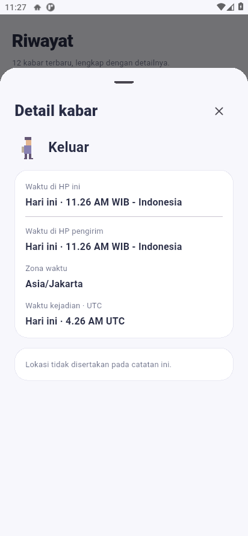 |

Detail dapat digulir untuk melihat seluruh informasi dan tombol peta. Koordinat, akurasi dan waktu lokasi berasal dari kejadian itu; catatan tanpa GPS tidak meminjam lokasi terakhir.

## Satu waktu, dua mode

Keduanya menunjukkan **18.00 WIB - Indonesia**. Langit pixel mengikuti malam, sementara mode layar tetap mengikuti pilihan pengguna.

| In Relationship · Gelap | In Relationship · Terang |
|---|---|
| 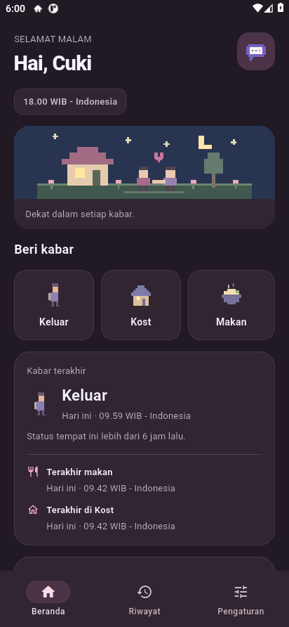 | 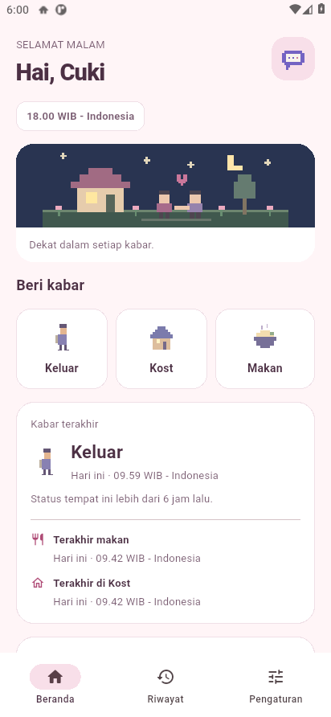 |

## Default dan pengaturan

Tema Default memakai periwinkle/krem. In Relationship memakai rose/lilac, dua karakter dan hati pixel. Tema serta mode hanya mengubah HP yang memilihnya.

| Default | Pengaturan Appearance |
|---|---|
| 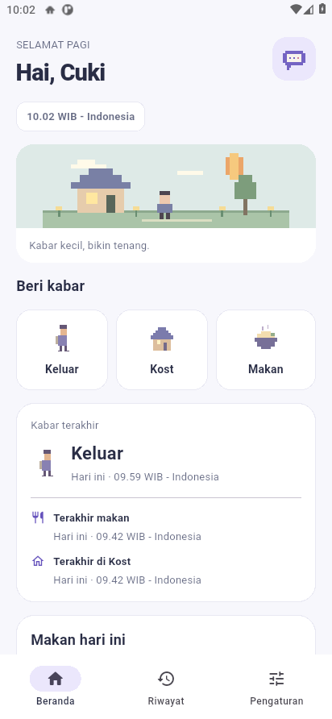 | 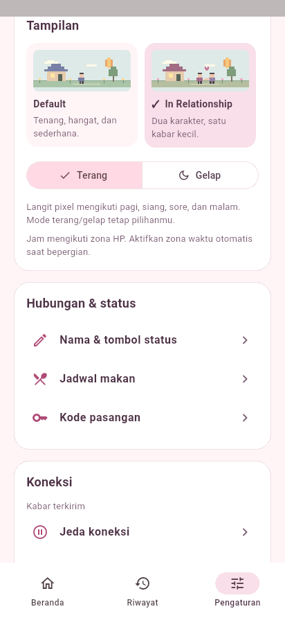 |

Pagi 05–11 · Siang 11–15 · Sore 15–18 · Malam 18–05. Batas ini mengikuti jam lokal HP; bukan waktu matahari terbit/terbenam astronomis.

## Ikon aplikasi

## Tampilan yang sama pada iPhone

Screenshot iPhone berikut berasal dari QA versi 0.5.0 yang lulus. QA iPhone 0.6.0 sedang diulang setelah build berhasil tetapi alat uji tidak menemukan port simulator. Jam mengikuti GMT/UTC yang dipakai CI. Aplikasi iPhone fisik tetap memerlukan signing Apple/TestFlight.

| Beranda iPhone | Pengaturan iPhone |
|---|---|
| 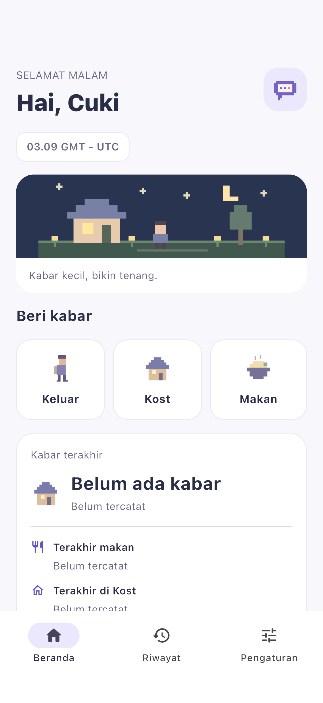 | 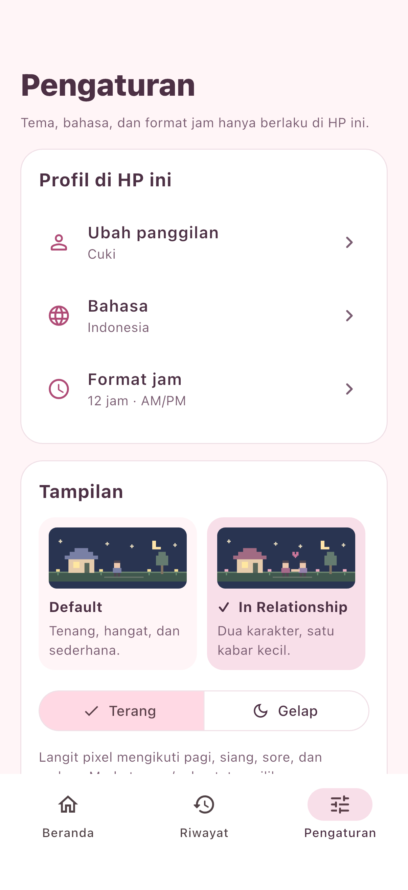 |

[Unduh abc.apk](abc.apk) · [Panduan](README.md) · [Hasil QA](QA.md)
