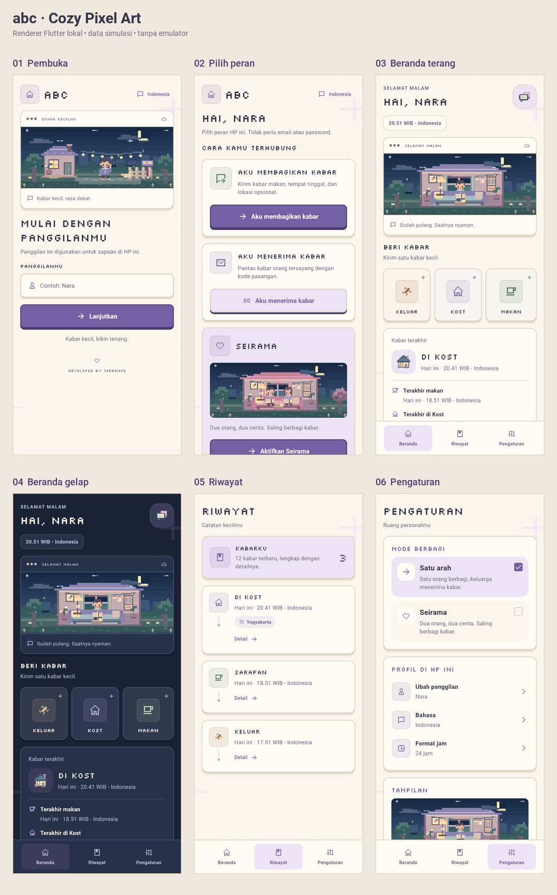
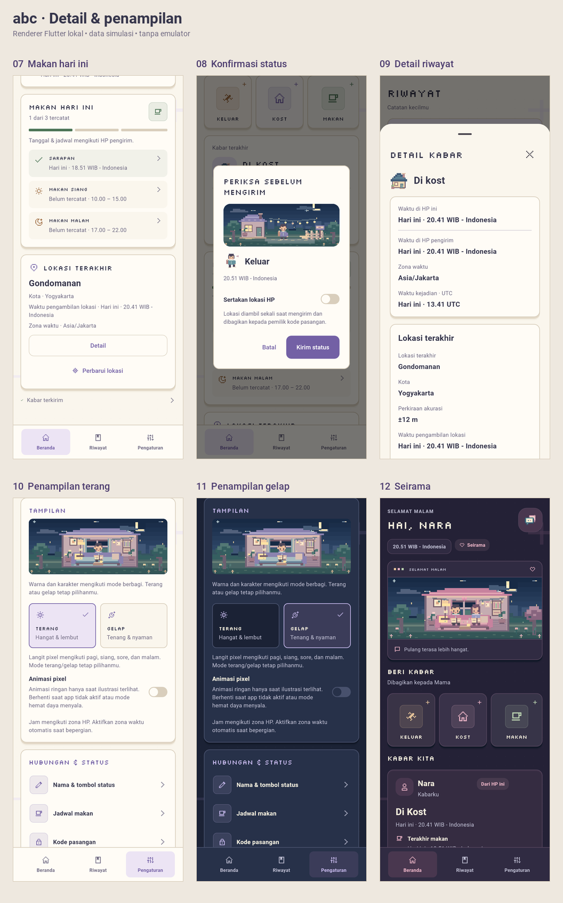

# Cozy Pixel Art — pratinjau desain Flutter

Perombakan ini sudah mengubah halaman aplikasi. Pembuka dan pilihan peran memakai
ShadInput/ShadButton; Beranda memakai grid ShadCard; judul memakai PixelifyText
(wrapper PixelText dari pixelify_flutter); ikon memakai pixelarticons. Kartu
memiliki border kertas, bayangan bertingkat dan gerakan singkat saat ditekan.
Teks informasi memakai font biasa agar tetap mudah dibaca.

Terang memakai cream/lavender; gelap memakai navy/slate. Seirama memakai aksen
rose dan dua karakter setelah mode berbagi dikonfirmasi. Ilustrasi mengikuti waktu
lokal secara terpisah dari pilihan terang/gelap. Bingkai 160:64 menampilkan dunia
pixel secara utuh, dengan detail lampu, tanaman, ruangan dan latar berlapis.

"Developed by Terrence" ditampilkan pada pembuka, pilihan peran dan Pengaturan.
Contoh panggilan kini Nara.

## Pratinjau setiap halaman

Gambar berikut adalah hasil renderer Flutter lokal dengan font asli dan data
simulasi Nara/Yogyakarta. Ini **belum screenshot emulator atau HP fisik**.
Ukuran viewport 400 × 900 dp; PNG 800 × 1800 px. Scroll untuk panel yang berada
di bawah layar. Screenshot fase inisialisasi sebelumnya tetap menjadi arsip dan
tidak digunakan sebagai bukti hasil baru.





| Halaman/panel | Pratinjau ukuran penuh |
|---|---|
| Pembuka & panggilan | [Lihat gambar](../screenshots/cozy-redesign/01-welcome.png) |
| Pilih peran | [Lihat gambar](../screenshots/cozy-redesign/02-roles.png) |
| Pilihan Seirama pada setup | [Lihat gambar](../screenshots/cozy-redesign/03-roles-seirama.png) |
| Beranda terang | [Lihat gambar](../screenshots/cozy-redesign/04-home-light.png) |
| Beranda gelap | [Lihat gambar](../screenshots/cozy-redesign/05-home-dark.png) |
| Makan hari ini | [Lihat gambar](../screenshots/cozy-redesign/06-meals.png) |
| Riwayat | [Lihat gambar](../screenshots/cozy-redesign/07-history.png) |
| Detail riwayat & lokasi | [Lihat gambar](../screenshots/cozy-redesign/08-detail.png) |
| Pengaturan | [Lihat gambar](../screenshots/cozy-redesign/09-settings.png) |
| Penampilan terang | [Lihat gambar](../screenshots/cozy-redesign/10-appearance-light.png) |
| Penampilan gelap | [Lihat gambar](../screenshots/cozy-redesign/11-appearance-dark.png) |
| Footer Pengaturan | [Lihat gambar](../screenshots/cozy-redesign/12-settings-footer.png) |
| Beranda Seirama | [Lihat gambar](../screenshots/cozy-redesign/13-seirama-dark.png) |
| Konfirmasi status | [Lihat gambar](../screenshots/cozy-redesign/14-status-confirmation.png) |

## File yang berubah dalam perombakan ini

File fondasi tema/font/dependency lokal dari tahap sebelumnya dipertahankan.
Daftar berikut mencatat perubahan tahap perombakan ini.

| File | Perubahan |
|---|---|
| [pubspec.yaml](pubspec.yaml) | Menambah pixelarticons ^0.4.0; shadcn_ui ^0.57.1 dan pixelify tetap dipakai. |
| [pubspec.lock](pubspec.lock) | Hasil resolusi dependency yang dipakai pemeriksaan lokal. |
| [lib/main.dart](lib/main.dart) | Satu ShadApp; pembuka, pilih peran, Beranda, Riwayat, Pengaturan, navigasi, switch dan dialog. |
| [lib/app_theme.dart](lib/app_theme.dart) | Cream/lavender dan navy/slate; tipografi body, kartu, border dan tema dialog yang konsisten. |
| [lib/cozy_ui.dart](lib/cozy_ui.dart) | Komponen bersama: PixelifyText, CozyCard, CozyButton, CozyPress, CozyScene, navigasi dan footer. |
| [lib/pixels.dart](lib/pixels.dart) | Palet cozy, atap lavender, lampu kecil, detail ruangan, jamur dan tanaman berlapis. |
| [lib/strings.dart](lib/strings.dart) | Contoh panggilan Nara serta copy baru dalam Indonesia, English, Deutsch. |
| [test/app_test.dart](test/app_test.dart) | Ekspektasi palet baru dan pencarian detail lokasi yang terpisah dari chip lokasi di riwayat. |
| [test/cozy_ui_test.dart](test/cozy_ui_test.dart) | Enam regresi: pembatalan sentuhan, reduced motion, pembuka/peran/keyboard pada tiga bahasa 200%, appearance/footer. |
| [tool/theme_preview.dart](tool/theme_preview.dart) | Data simulasi konsisten untuk panggilan, makan, tempat dan zona waktu; tidak mengakses GPS/jaringan nyata. |
| [tool/cozy_preview_test.dart](tool/cozy_preview_test.dart) | Merender 14 pratinjau memakai halaman aplikasi dan font aslinya, tanpa emulator. |
| [PREVIEW_LOKAL.md](PREVIEW_LOKAL.md) | Panduan dan galeri perombakan lokal ini. |

Salinan 14 PNG dan dua galeri untuk GitHub disimpan di
`../screenshots/cozy-redesign/`. Sumber render lokal tetap di
`qa-screenshots/cozy-redesign/` (diabaikan Git). APK **0.9.0** sudah dibangun dari desain ini dan tersedia sebagai `../abc.apk`.
Signature, minimum Android 10, tiga ABI dan aset suara release sudah diverifikasi.

## Pemeriksaan yang selesai

- `flutter analyze`: tidak ada masalah.
- `flutter test`: 43 tes unit/widget lulus.
- Render lokal: 14 gambar berhasil dibuat tanpa error layout.
- Regresi mencakup konfirmasi status, jam 24/AM-PM, detail lokasi, persetujuan
  Seirama, penghapusan data aplikasi, tiga bahasa dan ukuran teks 200%.
- Animasi tombol hanya berjalan ketika disentuh. Preferensi animasi, reduced
  motion dan mode hemat daya dihormati. Ilustrasi menghentikan repaint ketika
  berada di luar viewport, tertutup dialog atau aplikasi tidak aktif.

**QA emulator/perangkat menunggu instruksi pengguna.** Notifikasi antar-HP,
izin lokasi native, instalasi APK, performa perangkat dan konsumsi baterai belum
diuji ulang dengan desain ini. Render lokal hanya membuktikan tampilan/alur UI.

## Menjalankan setelah memilih perangkat/emulator

Dari folder `crossplatform`, menggunakan Flutter 3.47.6 pada PATH:

```powershell
flutter pub get
flutter devices
flutter run --target tool/theme_preview.dart -d <device-id>
```

Entrypoint preview memakai halaman aplikasi yang sama dengan backend simulasi.
Untuk menguji integrasi native dan kabar antar-HP, gunakan entrypoint aplikasi:

```powershell
flutter run -d <device-id>
```

Gunakan SDK Flutter yang sesuai dengan versi pada workflow CI.
Preview offline bukan pengganti pengujian integrasi.

Untuk membuat ulang galeri render lokal tanpa emulator:

```powershell
flutter test tool/cozy_preview_test.dart
```

## Dependency dan font

Package pixelify 0.0.1 memakai patch lokal sebelumnya melalui
`dependency_overrides`, untuk file wave kosong dan timer PixelText. Global pub
cache tidak diubah. Patch beserta lisensi MIT ada di
`third_party/pixelify_flutter/PATCHES.md`.

Font Silkscreen dan lisensi OFL dibundel lokal; tidak ada unduhan font saat
aplikasi berjalan. Shader Pixelify tetap dinonaktifkan. Implementasi kompatibel
path_provider Android/Foundation dari tahap fondasi dipertahankan.
